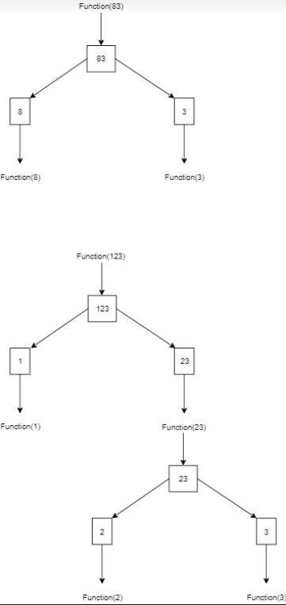

# Number-to-Japanese-Romaji-and-Hiragana

This is the right tool for you if you want to learn Japanese numbers. It convert zero and any integer ranged from 1 to 1x10^11 (hundred billions) 
into Japanese Romaji or Japanese Hiragana. It sure helps you learn Japanese numbers.

## How it works?

###### Text explanation:

In this code, I use recursive method to achieve my goal. Basically when an input is entered, if the digit of the number is one, it just 
give away what the number is called. For example if the input is 1, then the output is simply a word of number 1 in japanese, which is *Ichi* or *いち*.
*Ni* for 2, *San* for 3 and so on.

If the digit of the number is two, then start from here until later the recursive method will always be used. When an input is entered, I split the number 
and store it in two different number named front number and back number. For example if the input is 21, then i split them into 2 and 1, 2 is the front and 1 is the back.
After that I call functions that will decide what number are they and what are they called in japanese. It works for all number with digits more than one.

###### Image explanation:

Well if you think the text explanation don't make any senses, let me explain you through the image

